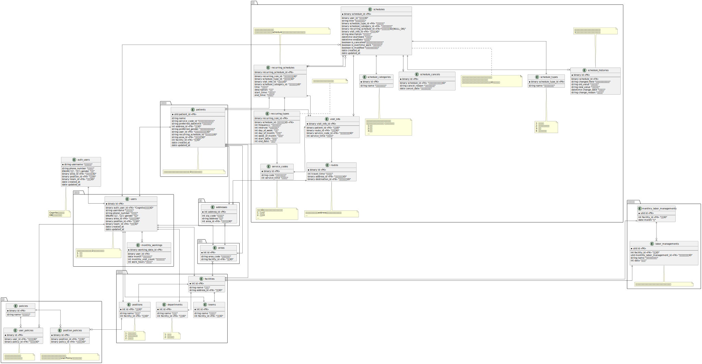

> **全体**

> **テーブル詳細**

- [スタッフ](./tables/users.md)
- [予定](./tables/schedules.md)
- [患者](./tables/patients.md)
- [権限](./tables/policies.md)
- [施設](./tables/facilities.md)
- [住所・エリア](./tables/addresses.md)
- [経営情報](./tables/labor_managements.md)
- [訪問情報](./tables/visit_infos.md)
