# インフラ構成

### S3

SPA コンテンツをホスティング。

### CloudFront

S3 に格納されている SPA コンテンツをキャッシュし、ユーザーに近いエッジロケーションから配信。
Certificate Manager から取得した SSL 証明書を利用し、HTTPS による通信を行う。

### APIGateway・Lambda・Cognito・NLB

クライアントのリクエストを受け取り、VPCLink と NLB を介してプライベートサブネットに配置している API サーバーへルーティングを行う
リクエスト毎に Lambda オーソライザーを利用し、ユーザーの認証を行う。
ユーザー管理には Cognito を利用する。

- [認証方法](../機能詳細/認証認可・ユーザー管理/認証認可.md)

### AZ・Subnet

下記の点からシングル AZ で構築している

- ユーザーが 1 施設あたり 100 人程度
- プロトタイプであること

APIServer・DB ともに PrivateSubnet で管理し、インターネットからのアクセスを制限する（APIGateway・VPCLink・NLB を介してリソースへアクセスできるように）

### ECS・Fargate・ECR

Go + Gin で作成した API サーバーを管理

### RDS

アプリ内で利用するデータを管理する

### ElasticCache

Cognito から取得した Token を SessionID と紐づけて管理する。
