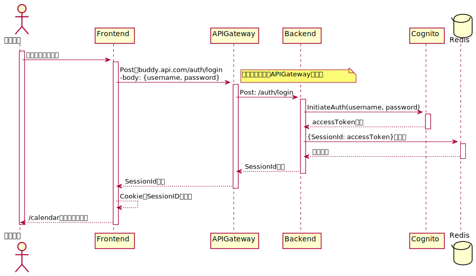

# 認証認可

認証は Cognito で行い、認可は Backen で行う

認可では、ユーザーの権限を確認する  
[権限情報](./権限.md)

## 認証

ユーザーの認証は Cognito を利用 
**受け取った Token をクライアントで保存する** 
ユーザーが権限付きの API を発行する場合、Cognito 側で Token の検証を行う。 
→ 成功した場合 Backend 側で認可処理を行う

## 認可

リクエストからユーザー情報を受け取り、ユーザーの権限を確認して実行可否を判定する
案として、二つの実装方法が考えられる

### Authorizer（Lambda） を利用する場合

認可の一部を Authorizer に移譲することができる。
ただ、ユーザーの権限によって取得するリソースが変わったりするため、権限チェックは Backend で行う必要がある？

### Authorizer を利用しない場合

認可を Backend で全て担うパターン

