# 画面一覧

| 画面名                             | Path                             | 閲覧権限        |
| ---------------------------------- | -------------------------------- | --------------- |
| ログイン                           | /login                           | all             |
| [カレンダー](./予定/カレンダー.md) | /schedule                        | all(※1)         |
| 患者一覧                           | /patient                         | all             |
| 患者登録                           | /patient/new                     | manager         |
| 患者登録内容確認                   | /patient/new/confirm             | manager         |
| 患者情報編集                       | /patient/:patientId/edit         | manager         |
| 患者情編集確認                     | /patient/:patientId/edit/confirm | manager         |
| 職員一覧                           | /staff                           | manager, reader |
| 職員詳細                           | /staff/:staffId                  | manager, reader |
| 職員登録                           | /staff/new                       | manager         |
| 職員登録内容確認                   | /staff/new/confirm               | manager         |
| 職員情報編集                       | /staff/edit                      | manager         |
| 職員情報編集内容確認               | /staff/edit/confirm              | manager         |
| プロフィール                       | /profile                         | all             |
| パスワード更新                     | /profile/password/update         | all             |

※1. カレンダーは権限によって、他のスタッフの予定を表示するかを決める\
※2. 予定編集はメンバーは個人の予定しか編集することができない

## 画面遷移図

